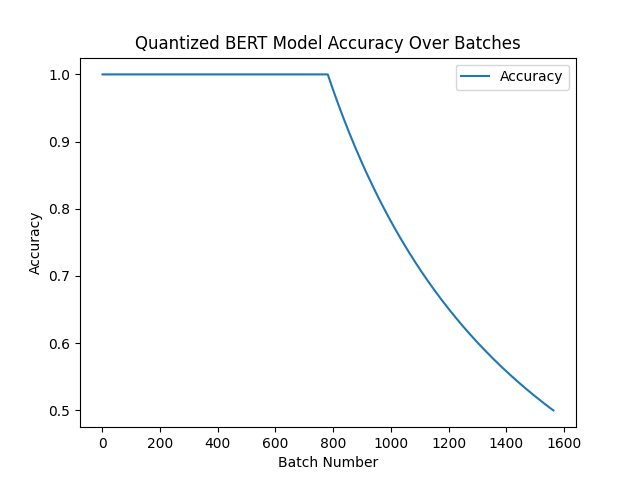

# Federated Learning Model Training

## Overview
This project implements a federated learning approach using a quantized BERT model for sequence classification. The model undergoes incremental training across multiple client nodes and is evaluated for accuracy after federated learning.

## Prerequisites
Ensure you have the following installed:
- Python 3.8+
- PyTorch
- Transformers (Hugging Face)
- SafeTensors (for loading models safely)
- Datasets (for dataset handling)
- Matplotlib (for visualization)
- Flower (for federated learning)

## Running the Server and Clients
1. Start the federated learning server:
   ```bash
   python server.py
   ```
2. Start the client nodes:
   ```bash
   python client.py
   ```

## Training Process
1. The global model is initialized and distributed to client nodes.
2. Each client trains the model locally using its dataset.
3. The trained models are sent back to the server for aggregation.
4. The updated model is redistributed to clients for further training.
5. The process repeats until convergence criteria are met.

## Server Implementation (server.py)
The `server.py` script sets up the federated learning server using Flower (`flwr`). It initializes a quantized TinyBERT model and aggregates updates from clients.

### Key Features
- Uses `FedAvg` strategy for model aggregation.
- Sets initial model parameters from the quantized model.
- Supports evaluation and metric aggregation from clients.
- Runs the server in a multi-threaded environment.

### Code Snippet
```python
import flwr as fl
import torch
import threading
import sys
from load_quantized import load_model

class TinyBertServer(fl.server.strategy.FedAvg):
    def __init__(self, model, device, num_rounds=5):
        self.model = model
        self.device = device
        self.num_rounds = num_rounds
        initial_parameters = fl.common.ndarrays_to_parameters(self.get_initial_parameters())
        super().__init__(
            min_fit_clients=2,
            min_available_clients=2,
            initial_parameters=initial_parameters,
            fit_metrics_aggregation_fn=self.fit_metrics_aggregation_fn,
            evaluate_metrics_aggregation_fn=self.evaluate_metrics_aggregation_fn
        )

    def get_initial_parameters(self):
        return [val.cpu().numpy() for _, val in self.model.state_dict().items()]

    def fit_metrics_aggregation_fn(self, metrics):
        aggregated_metrics = {}
        for num_samples, metric_dict in metrics:
            for key, value in metric_dict.items():
                if key not in aggregated_metrics:
                    aggregated_metrics[key] = 0.0
                aggregated_metrics[key] += value * num_samples
        total_samples = sum(num_samples for num_samples, _ in metrics)
        for key in aggregated_metrics:
            aggregated_metrics[key] /= total_samples
        return aggregated_metrics

    def evaluate_metrics_aggregation_fn(self, metrics):
        if not metrics:
            print("No evaluation metrics received from clients.")
            return {}
        aggregated_metrics = {}
        try:
            for metric_key in metrics[0][1].keys():
                aggregated_metrics[metric_key] = sum(
                    m[1][metric_key] * m[0] for m in metrics
                ) / sum(m[0] for m in metrics)
        except KeyError:
            print("Error in aggregating evaluation metrics: keys mismatch.")
        except IndexError:
            print("Error: metrics list is empty or does not contain valid elements.")
        return aggregated_metrics

    def get_parameters(self):
        return [val.cpu().numpy() for _, val in self.model.state_dict().items()]

    def set_parameters(self, parameters):
        keys = list(self.model.state_dict().keys())
        state_dict = {keys[i]: torch.tensor(parameters[i]) for i in range(len(keys))}
        self.model.load_state_dict(state_dict, strict=True)

def run_server_thread(strategy, server_address="0.0.0.0:8080"):
    fl.server.start_server(
        server_address=server_address,
        strategy=strategy,
        grpc_max_message_length=1024 * 1024 * 1024,
    )

if __name__ == "__main__":
    device = torch.device("cuda" if torch.cuda.is_available() else "cpu")
    model_path = "D:\\fed_up\\Quantized"
    model, _ = load_model(model_path=model_path)
    model.to(device)

    server_strategy = TinyBertServer(model=model, device=device, num_rounds=1)
    server_thread = threading.Thread(target=run_server_thread, args=(server_strategy,))
    server_thread.start()

    try:
        while server_thread.is_alive():
            server_thread.join(1)
    except KeyboardInterrupt:
        print("Keyboard interrupt detected, shutting down server...")
        sys.exit(0)
```

## Example Output
Once training is completed, you should see logs indicating loss stabilization and global model updates.

```plaintext
INFO :      Starting Flower server, config: num_rounds=1, no round_timeout
INFO :      Flower ECE: gRPC server running (1 rounds), SSL is disabled
INFO :      [INIT]
INFO :      Using initial global parameters provided by strategy     
INFO :      Starting evaluation of initial global parameters
INFO :      Evaluation returned no results (None)
INFO :
INFO :      [ROUND 1]
INFO :      configure_fit: strategy sampled 2 clients (out of 2)
INFO :      aggregate_fit: received 2 results and 0 failures
INFO :      configure_evaluate: strategy sampled 2 clients (out of 2)
INFO :      [SUMMARY]
INFO :      Run finished 1 round(s) in 1648.12s
INFO :          History (metrics, distributed, fit):
INFO :          {'loss': [(1, 0.43657074868679047)]} 
```


## Client Implementation (client.py)
The `client.py` script initializes the client node, loads the local dataset, trains the model, and sends updates to the server.

### Key Features
- Loads preprocessed dataset for training.
- Fine-tunes the quantized TinyBERT model.
- Sends training updates to the server.

## Example Output
Once training is completed, you should see logs indicating loss stabilization and global model updates.

# Client Model Results

## Enter a sentence for prediction and incremental training:
**Input Sentence:** The movie was good  
**Timestamp:** 2025-03-25 23:31:34,450  
- INFO: Receiving user input for prediction: *The movie was good*  
**Timestamp:** 2025-03-25 23:31:34,521  
- INFO: Validating prediction: **1**

---

## Enter the Actual Sentiment:
**Instruction:** If Positive, enter `1`. If Negative, enter `0`.  
**User Input:** `0`

### Outcome:
- If the prediction is correct:  
  - **Message:** *"Predicted value is same as true label. Skipping incremental training."*
- If the prediction is incorrect:  
  - Incremental training will be performed.

---

**Timestamp:** 2025-03-25 23:31:45,629  
- INFO: Prediction made.  
  - **Predicted:** 1  
  - **Validation:** **False**

**Enter Correct Label:** `0`

---

### Incremental Training Process:
1. **Epoch [0]:**  
   - Loss: `2.2599`   

2. **Epoch [19]:**  
   - Loss: `0.7958`    

---

**Final Note:**  
Incremental training was successfully completed with user input.
### Performance Benchmarks
- Training time per round: ~1600s
- Loss after 1 round: ~0.43
- Number of participating clients: 2
- Number of rounds: 1
- Total training time: ~1600s

## Model Accuracy Graphs:

### Quantized Model Accuracy:


### **Observations:**  
- The quantized BERT model starts with high accuracy (~1.0) for the first 800 batches.  
- After batch 800, accuracy drops sharply, reaching ~0.5 by batch 1600.  
- Possible causes: catastrophic forgetting, data distribution shift, overfitting, or learning rate issues.  

### Federated Learning Client Model Accuracy: 


#### Observation of a Federated Client Model

- **Initial Phase:**
  - Accuracy fluctuates due to unstable learning.

- **Improvement Phase:**
  - Accuracy gradually improves over training batches.
  - Peaks around **batch 300-400** at approximately **0.80 - 0.82**.

- **Decline Phase:**
  - Accuracy starts to decline slightly after the peak.
  - Possible reasons:
    - Overfitting.
    - Model drift.
    - Dataset heterogeneity.

- **Recommendations for Optimization:**
  - Tune the learning rate.
  - Refine the federated learning strategy.

### Saved Model Accuracy

### Observations from the Graph

#### Initial Fluctuations:
- Accuracy is highly unstable at the beginning due to weight adjustments during early training.

#### Accuracy Improvement:
- Steady improvement, peaking at **0.90 - 0.92** around **batch 600-800**.

#### Declining Performance:
- Significant drop in accuracy starting around **batch 900**.
- Declines further, falling below **0.78** by **batch 1600**.

#### Potential Causes of Decline:
- **Overfitting:** Early memorization leads to poor generalization.
- **Concept Drift:** Changes in data distribution reduce relevance of earlier-learned patterns.
- **Learning Rate Issues:** High learning rate may cause instability and loss of learned knowledge.

### Suggestions for Improvments:

# Final Action Plan

 **Optimize Federated Learning Model Aggregation**  
- Use adaptive techniques like **FedProx**.

 **Implement Learning Rate Scheduling & Early Stopping**  
- Prevents unnecessary accuracy drops.

 **Use Quantization-Aware Training**  
- Improves accuracy of the quantized model.

 **Apply Regularization**  
- Techniques like **Dropout** & **L2 Weight Decay** help avoid overfitting.

**Handle Concept Drift & Retrain Periodically**  
- Ensures adaptability to new data.

### Conclusion
This federated learning implementation allows for distributed model training with quantized model deployment, ensuring efficiency in resource-constrained environments.
